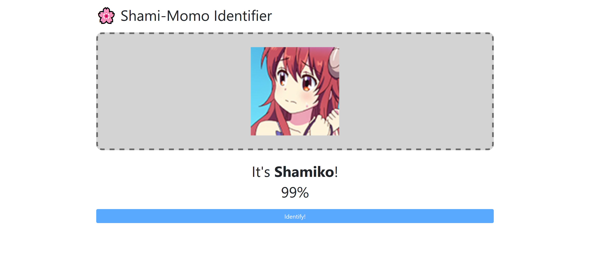

# Shami-Momo Identifier

Identifies if an image is of Shamiko or Momo using ResNet-18 trained off of Roger Park's
[Machikado Mazoku face collection](https://onedrive.live.com/?id=5524F7DE20BB5EB2%21269088&cid=5524F7DE20BB5EB2).



## Development

```
yarn install
yarn start
```